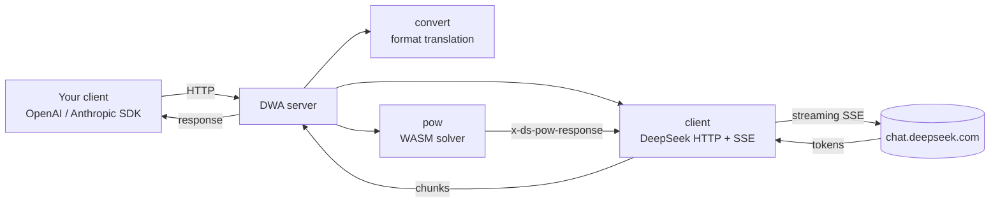

<div align="center">

# DWA

### DeepSeek Web API

A single Go binary that exposes the OpenAI and Anthropic chat APIs on top of the DeepSeek web app.


</div>

---

## What it does

DWA talks to the unofficial `chat.deepseek.com` web API and re-exposes it through two standard interfaces:

- **OpenAI** - `POST /v1/chat/completions`
- **Anthropic** - `POST /v1/messages`

Point any OpenAI or Anthropic SDK at `http://127.0.0.1:8000` and it just works. Streaming and non-streaming are both supported, and the proof-of-work challenge that the web app requires is solved locally with the original WASM module.

## How it works



Each request fetches a POW challenge and a HIF token in parallel, solves the challenge through `sha3_pow.wasm`, then streams the completion back and converts it to the format the client asked for. Conversations reuse a cached DeepSeek session so multi-turn chats keep their context.

## Quick start

**Requirements:** Go 1.22+ and a DeepSeek account.

```bash
# 1. Set your token
cp .env.example .env
#    then edit .env and paste your DEEPSEEK_TOKEN

# 2. Run
go run .
```

On Windows you can just double-click `start.bat`. It builds the binary if needed and launches the server.

```
 DWA - DeepSeek Web API
 OpenAI:    http://127.0.0.1:8000/v1/chat/completions
 Anthropic: http://127.0.0.1:8000/v1/messages
 Models:    http://127.0.0.1:8000/v1/models
```

## Getting your token

The token is the `Bearer` value the web app sends, not a cookie.

1. Log in at [chat.deepseek.com](https://chat.deepseek.com) and send any message.
2. Open DevTools (`F12`) and go to the **Network** tab.
3. Find the request to `/api/v0/chat/completion`.
4. Under **Request Headers**, copy the value after `Authorization: Bearer`.
5. Paste it into `.env` as `DEEPSEEK_TOKEN`.

The token is tied to your session and expires over time. When you start seeing `40003 invalid token`, grab a fresh one the same way.

## Endpoints

| Method | Path | Format | Notes |
|--------|------|--------|-------|
| `GET`  | `/v1/models` | - | Lists the available model IDs |
| `POST` | `/v1/chat/completions` | OpenAI | Streaming and non-streaming |
| `POST` | `/v1/messages` | Anthropic | Streaming and non-streaming |

## Response previews

**OpenAI - non-streaming**

```bash
curl http://127.0.0.1:8000/v1/chat/completions \
  -H "Content-Type: application/json" \
  -d '{"model":"deepseek-chat","messages":[{"role":"user","content":"Say hi in one word"}]}'
```

```json
{
  "id": "chatcmpl-18b4adb1e8094f38",
  "object": "chat.completion",
  "created": 1780238735,
  "model": "deepseek-chat",
  "choices": [
    {
      "index": 0,
      "message": { "role": "assistant", "content": "Hi" },
      "finish_reason": "stop"
    }
  ],
  "usage": { "prompt_tokens": 0, "completion_tokens": 0, "total_tokens": 0 }
}
```

**OpenAI - streaming** (`"stream": true`)

```
data: {"choices":[{"delta":{"content":"1","role":"assistant"},"finish_reason":null,"index":0}],"model":"deepseek-chat","object":"chat.completion.chunk"}

data: {"choices":[{"delta":{"content":" ","role":"assistant"},"finish_reason":null,"index":0}],"model":"deepseek-chat","object":"chat.completion.chunk"}

data: {"choices":[{"delta":{"content":"2","role":"assistant"},"finish_reason":null,"index":0}],"model":"deepseek-chat","object":"chat.completion.chunk"}

data: [DONE]
```

**Anthropic**

```bash
curl http://127.0.0.1:8000/v1/messages \
  -H "Content-Type: application/json" \
  -d '{"model":"deepseek-chat","max_tokens":100,"messages":[{"role":"user","content":"Say hello in one word"}]}'
```

```json
{
  "id": "msg_18b4adb4b6943064",
  "type": "message",
  "role": "assistant",
  "model": "deepseek-chat",
  "content": [{ "type": "text", "text": "Hello" }],
  "stop_reason": "end_turn",
  "stop_sequence": null,
  "usage": { "input_tokens": 1, "output_tokens": 1 }
}
```

## Project structure

```
DWA/
├── main.go                 entry point: loads .env, parses flags, starts server
├── sha3_pow.wasm           the POW module from the DeepSeek web app
├── start.bat               Windows launcher (builds then runs)
├── .env.example            token template
└── internal/
    ├── pow/                WASM proof-of-work solver (wazero)
    ├── client/             DeepSeek HTTP client, sessions, SSE streaming
    ├── convert/            OpenAI / Anthropic <-> DeepSeek translation
    └── server/             HTTP handlers and session cache
```

## Configuration

| Variable | Default | Description |
|----------|---------|-------------|
| `DEEPSEEK_TOKEN` | (required) | Bearer token from the web app |
| `HOST` | `127.0.0.1` | Bind address |
| `PORT` | `8000` | Bind port |

Flags override the environment: `go run . -host 0.0.0.0 -port 9000`.

## Notes and limitations

- This uses an unofficial API, so it can break whenever the web app changes.
- The token is a session token and expires. There is no automatic refresh.
- `usage` token counts are placeholders. The web API does not report them.
- Tool calls are passed through a small XML convention and parsed back out, so behaviour depends on the model following the format.

## License

See [LICENSE](LICENSE).
